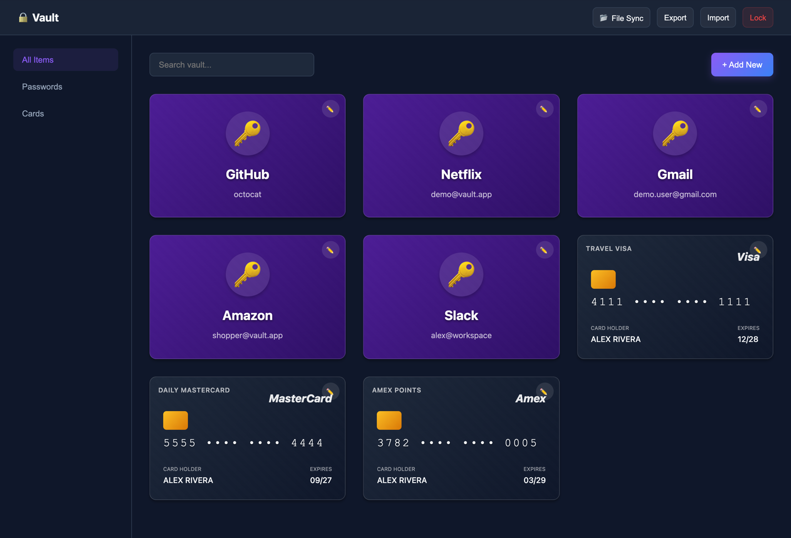
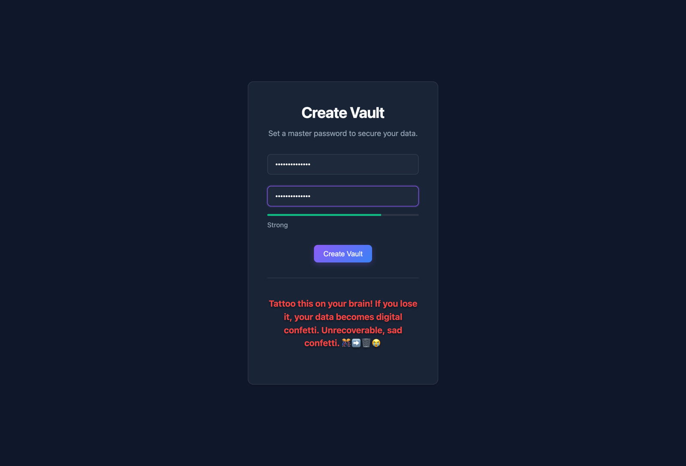
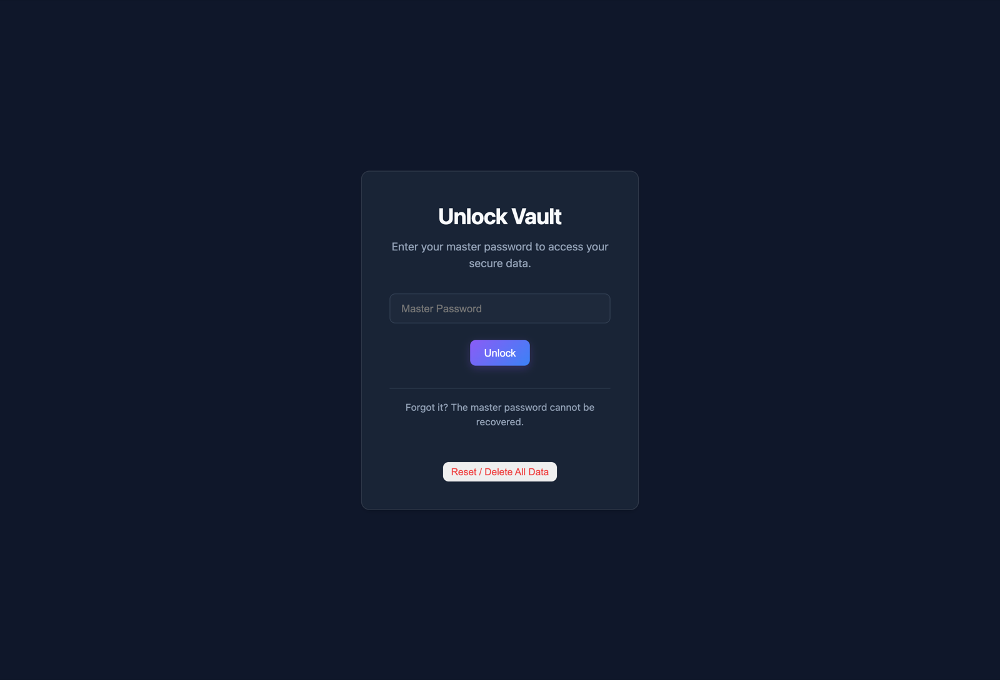
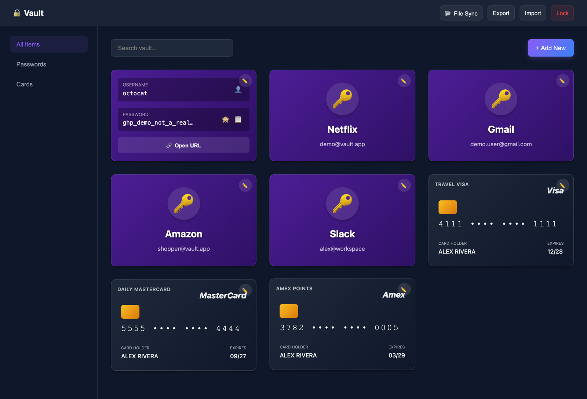
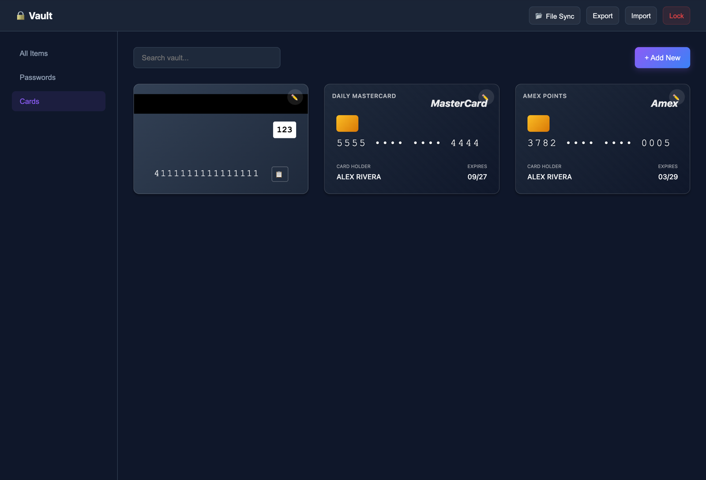
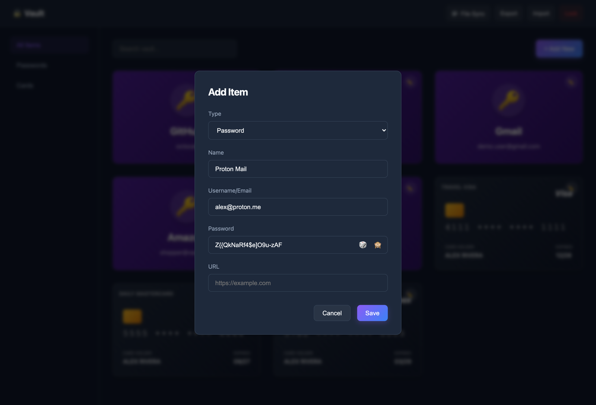
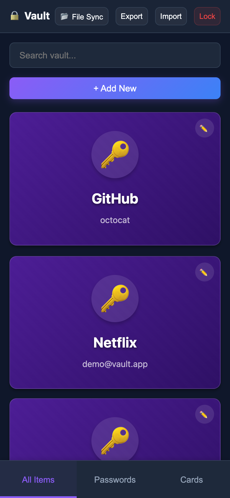

# Vault

**A private password and credit-card manager that runs entirely in your browser.**

There is no account, no backend, and no tracker. You choose a master password; Vault derives an encryption key on your device and stores only ciphertext. If someone copies the export file or the browser storage, they still need that password.

[](https://akgarhwal.github.io/vault/)
[](LICENSE)

<p align="center">
  
</p>

<p align="center"><sub>Sample data only — GitHub, Netflix, Gmail, Amazon, Slack, plus Visa / Mastercard / Amex test cards.</sub></p>

---

## What this project does

Vault is a **static web app** (HTML, CSS, vanilla JavaScript) that lets you:

1. Create a local vault locked by a master password
2. Save **logins** (username, password, URL) and **payment cards**
3. Reveal, copy, or open those items from a 3D flip card UI
4. Backup and restore the vault as an **already-encrypted JSON file**

Open the [live demo](https://akgarhwal.github.io/vault/) or serve the folder locally. Nothing is uploaded.

It is a good fit if you want a small, inspectable vault on one machine. It is **not** a hosted cloud manager like 1Password or Bitwarden — optional [File Sync](#file-sync) writes an encrypted file you can keep in iCloud, Drive, or a USB stick.

---

## Key features

| Feature | What you get |
| :--- | :--- |
| **Client-side encryption** | AES-256-GCM via the Web Crypto API. Key derived with PBKDF2-SHA-256 at **600,000** iterations. The master password never leaves the browser. |
| **Logins + cards** | Two item types, search, and sidebar filters (All / Passwords / Cards). |
| **3D flip cards** | Click a tile to flip it. Passwords stay masked until you show them. Cards detect Visa, Mastercard, and Amex from the number. |
| **Copy, then forget** | Copy username, password, or card number. The clipboard is cleared after **30 seconds** if it still holds that value. |
| **Password generator** | One click in the add/edit form fills a strong random password. |
| **Encrypted backup** | Export / import JSON. The file is ciphertext, not a plaintext dump. |
| **File Sync** | Chromium File System Access API can keep a `vault.json` in lockstep as you save items. |
| **Auto-lock** | Reloads (and drops plaintext from memory) after **2 minutes** idle, or **30 seconds** after the tab is hidden. |
| **Hardened browser app** | Strict CSP, http(s)-only URL opens, unlock backoff after failed attempts, master-password strength rules. |
| **Zero build** | No npm, no bundler, no framework. Serve the folder. |

---

## A look around

### Create a vault, then unlock it

First visit sets the master password (12+ characters with mixed character classes, or a 16+ character passphrase). Later visits only ask you to unlock. There is no recovery — lose the password and the data is gone.

<p align="center">
  
  &nbsp;
  
</p>

### Flip a login to copy or open it

The front shows the site and username. The back has copy buttons, a show/hide control, and **Open URL**.

<p align="center">
  
</p>

### Flip a card to see the number and CVV

Cards render like physical cards, including a chip and brand. Click to flip for the full number, CVV, and copy.

<p align="center">
  
</p>

### Add items without leaving the dashboard

Choose Password or Card, fill the form, optionally generate a password, save. Everything is encrypted before it hits `localStorage`.

<p align="center">
  
</p>

### Works on a phone

Filters collapse into a bottom bar. Search, add, export, and lock stay in reach.

<p align="center">
  
</p>

---

## Run it locally

The app uses **ES modules** and the **Web Crypto API**, so it must be served over `http://` or `https://`. Opening `index.html` as `file://` will not work.

### Python

```bash
cd vault
python3 -m http.server 8080
```

Then open [http://localhost:8080](http://localhost:8080).

### VS Code

1. Install the **Live Server** extension.
2. Right-click `index.html` → **Open with Live Server**.

### npx

```bash
npx serve .
```

---

## How encryption works

```text
Master password
      │
      ▼
 PBKDF2-HMAC-SHA-256   (600,000 iterations, random salt)
      │
      ▼
 AES-256-GCM key  ──►  each item is encrypted with its own IV
                       and bound to its id (AAD)
      │
      ▼
 localStorage  /  Encrypted JSON export  /  File Sync
```

- Unlock checks a small validation ciphertext before any item is decrypted.
- Vaults created with the older **100,000-iteration** KDF are re-encrypted automatically on the next successful unlock.
- Lock **reloads the page** so decrypted items and the key are dropped from memory.

Master password rules: at least **12 characters**, and either **3 character classes** (upper / lower / digit / symbol) or a **16+ character passphrase** with a space.

---

## File Sync

On Chromium browsers, **File Sync** asks you to pick a `vault.json` location. After that, saves rewrite that file so the encrypted vault can live next to your other backups.

The browser hides the real filesystem path. Click the path badge if you want to store a label (for example `~/Documents/vault.json`) so you remember where it is.

Safari and Firefox hide this button because they do not implement the File System Access API. Export still works everywhere.

---

## Security — what this does and does not protect

**Protects** encrypted data at rest: `localStorage`, export files, and sync files, against someone who does not know a strong master password.

**Does not protect** against malware, a malicious browser extension, a compromised copy of this site’s JavaScript, or an unlocked session on a shared device.

Other things to know:

- **Zero knowledge, zero recovery.** Nobody can reset the master password. If you lose it, the vault is gone.
- **Clearing site data deletes the vault.** Export regularly.
- Failed unlocks start backing off after a few tries.
- Copied secrets are cleared from the clipboard after 30 seconds when the browser allows clipboard read.

This is a personal tool, not an audited product. Read `js/crypto.js` and `js/security.js` if you need to trust it.

---

## Project layout

```text
vault/
├── index.html          # App shell, CSP, views, modals
├── js/
│   ├── boot.js         # file:// warning
│   ├── app.js          # Auth, lock, save, import/export, sync
│   ├── crypto.js       # PBKDF2, AES-GCM, password generator
│   ├── security.js     # Strength rules, URL allowlist, export checks
│   ├── storage.js      # localStorage
│   ├── ui.js           # Rendering, clipboard, toasts
│   ├── file-system.js  # File System Access API
│   └── db.js           # IndexedDB (sync file handle)
└── styles/             # Dark glass UI, cards, passwords, layout
```

**Stack:** Vanilla JavaScript, Web Crypto, localStorage, IndexedDB, File System Access API. MIT licensed.

---

## License

[MIT](LICENSE) © 2026 Abhinesh
